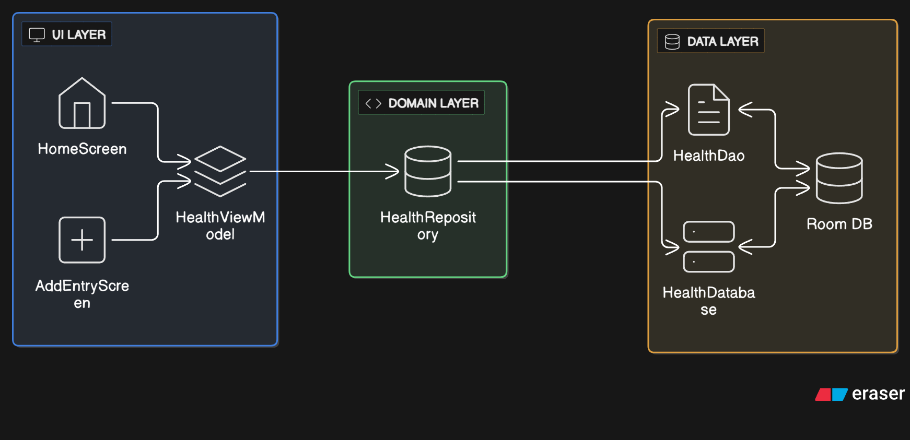
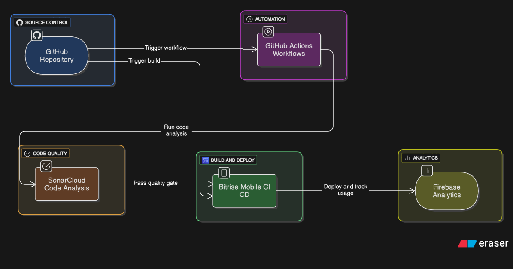

# 📱 HealthLog Android App - Complete DevOps Guide

**Primary Developer & Author:** [Denish Tomar](https://github.com/Denish3436)  
**Technical Mentor:** [Yugandhar Suthari](https://github.com/atic-yugandhar)  

> **A step-by-step guide to building a modern Android wellness tracking app with complete DevOps integration using only free tools.**

## 🎯 What You'll Build

**HealthLog** is a wellness tracking Android app where users can log daily health metrics like water intake, sleep hours, mood, and exercise minutes. You'll learn modern Android development with a complete DevOps pipeline.

### 🏗️ High-Level Architecture

### 🛠️ CI-CD Pipeline Architecture

### 🛠️ Tech Stack
- **Language**: Kotlin
- **UI**: Jetpack Compose + Material 3
- **Database**: Room (SQLite)
- **Architecture**: MVVM + Repository Pattern
- **Analytics**: Firebase Analytics & Crashlytics

### 🔧 DevOps Tools (All Free!)
| Tool | Purpose | Free Limits |
|------|---------|-------------|
| **GitHub Actions** | CI/CD automation | 2,000 minutes/month |
| **Bitrise** | Mobile CI/CD | 200 builds/month |
| **SonarCloud** | Code quality | Unlimited for public repos |
| **Dependabot** | Dependency updates | Free for all repos |
| **Firebase** | Analytics & crashes | Generous free tier |

---
### 🛠️ Running it locally 

---
## 📚 Resources & Documentation

### **Official Documentation**
- [Android Developer Guide](https://developer.android.com/guide)
- [Jetpack Compose Documentation](https://developer.android.com/jetpack/compose)
- [GitHub Actions Documentation](https://docs.github.com/en/actions)
- [SonarCloud Documentation](https://docs.sonarcloud.io/)
- [Bitrise Documentation](https://devcenter.bitrise.io/)
- [Firebase Documentation](https://firebase.google.com/docs)

### **Best Practices**
- [Android App Architecture Guide](https://developer.android.com/guide/architecture)
- [Kotlin Coding Conventions](https://kotlinlang.org/docs/coding-conventions.html)
- [CI/CD Best Practices](https://docs.github.com/en/actions/learn-github-actions/workflow-syntax-for-github-actions)
- [Mobile DevOps Guide](https://bitrise.io/mobile-devops-guide)

### **Community & Support**
- [Android Developers Community](https://developer.android.com/community)
- [Kotlin Community](https://kotlinlang.org/community/)
- [Stack Overflow](https://stackoverflow.com/questions/tagged/android)
- [Reddit r/androiddev](https://www.reddit.com/r/androiddev/)

---

## 🎉 Conclusion!

This project helps you build a **production-ready Android app** with a **complete DevOps pipeline** using only **free tools**! 

This project demonstrates real-world development practices that companies use for mobile applications. You now have experience with:

- ✅ Modern Android development (Kotlin, Compose, Room)
- ✅ Professional Git workflows (branches, PRs, code reviews)  
- ✅ Automated testing and quality assurance
- ✅ Continuous integration and deployment
- ✅ Code quality and security scanning
- ✅ Dependency management and updates
- ✅ Application monitoring and analytics

**Share your project** on GitHub, LinkedIn, or in your portfolio to showcase these valuable DevOps skills to potential employers!

---

*Built with ❤️ by Denish Tomar in collaboration with Yugandhar Suthari for learning modern Android development with DevOps best practices*